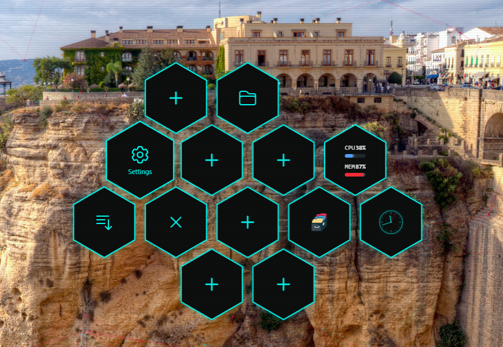

# Hexa Launcher

**キーボード操作に特化した、六角形グリッドのWindows用アプリケーションランチャー**


[🇺🇸 English](README.md)



Hexa Launcherは、六角形（ヘックス）グリッドを使用した革新的なランチャーです。直感的なキーボード操作と美しいビジュアルで、アプリケーション起動を効率化します。

## 主な特徴

- 🎯 **六角形グリッド**: 直感的な配置とナビゲーション。
- ⌨️ **キーボード中心**: マウス不要で高速操作が可能。
- 🎨 **テーマ変更**: Cyberpunkやミニマルなスタイルに変更可能。
- 🔍 **強力な検索**: あいまい検索、部分一致、正規表現に対応。
- ⚡ **高速起動**: `Alt+Space` で瞬時に呼び出し。

## クイックスタート

1. [Releases](https://github.com/Catharacta/hexa-launcher/releases) から最新のインストーラーをダウンロードします。
2. `hexa-launcher-setup.exe` を実行してインストールします。
3. `Alt+Space` で起動しましょう！

## ドキュメント

詳細な使い方、カスタマイズ方法、トラブルシューティングについては、ユーザーガイドをご覧ください：

📖 **[ユーザーガイド (日本語)](docs/USER_GUIDE_JA.md)**

## 開発

```bash
# リポジトリをクローン
git clone https://github.com/Catharacta/hexa-launcher.git
cd hexa-launcher

# 依存関係をインストール
npm install

# 開発モードで起動
npm run tauri dev
```

## ライセンス

MIT License - 詳細は [LICENSE](LICENSE) を参照してください。
